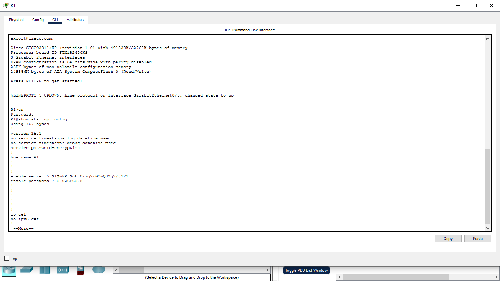
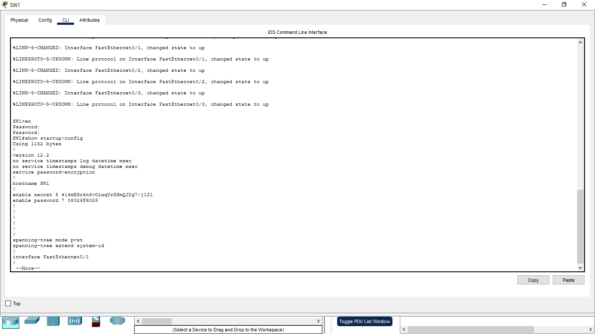

# Basic Device Security

## 1. What did I want to do?

The goal of this lab was to apply some basic security settings on Cisco devices.

I wanted to secure the router and switch by setting passwords, encrypting passwords in the configuration, and making sure the configuration is saved after a restart.

## 2. What did I do?

I configured basic security settings on:

* Router: R1
* Switch: SW1

I configured:

* Enable password
* Console password
* VTY password
* `enable secret`
* `service password-encryption`

After configuring the devices, I checked the configuration using:

```text
show running-config
```

I also saved the running configuration to the startup configuration so the settings would not be lost after a reboot.




## 3. What happened?

The devices were successfully configured with the security settings.

I used `show running-config` to verify the configuration on both R1 and SW1.

I also checked that the passwords were encrypted in the configuration and saved the configuration for startup.

Screenshots of the `show running-config` output are included as evidence.

## 4. What did I get wrong?

At first, I was not completely clear about the difference between `enable password` and `enable secret`.

I also had to understand the difference between `running-config` and `startup-config`, especially why the configuration needs to be saved before restarting the device.

## 5. What did I learn?

From this lab, I learned how to:

* Set passwords on Cisco devices.
* Secure privileged EXEC mode.
* Configure console and VTY access.
* Use `enable secret`.
* Use `service password-encryption`.
* Check the current configuration with `show running-config`.
* Save the configuration with `copy running-config startup-config`.
* Understand the difference between running and startup configuration.

This lab helped me understand the basic steps needed to secure and manage Cisco network devices.
