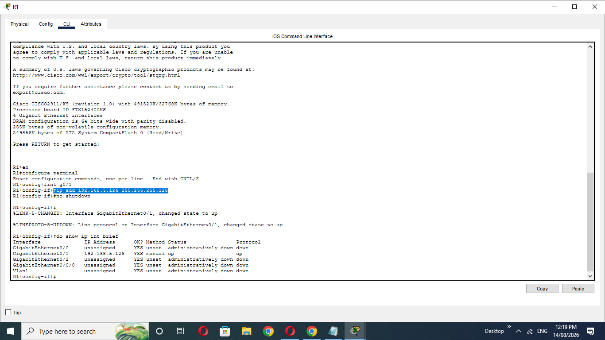
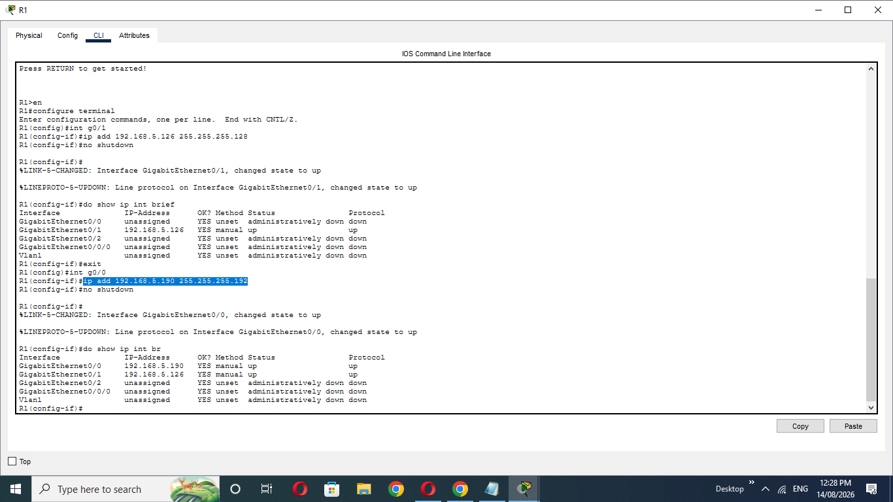
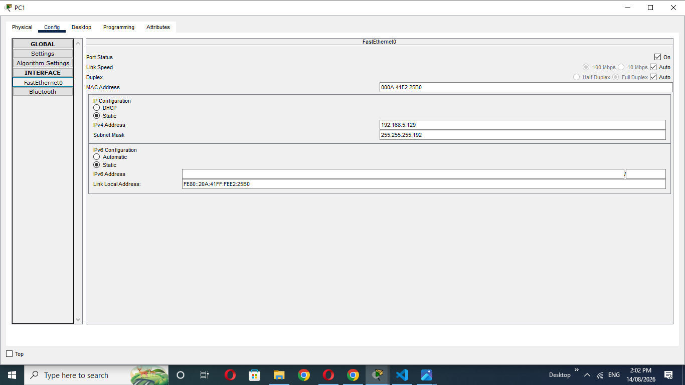
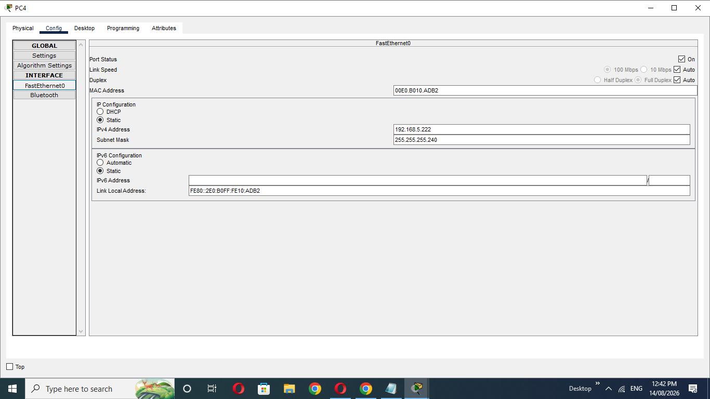
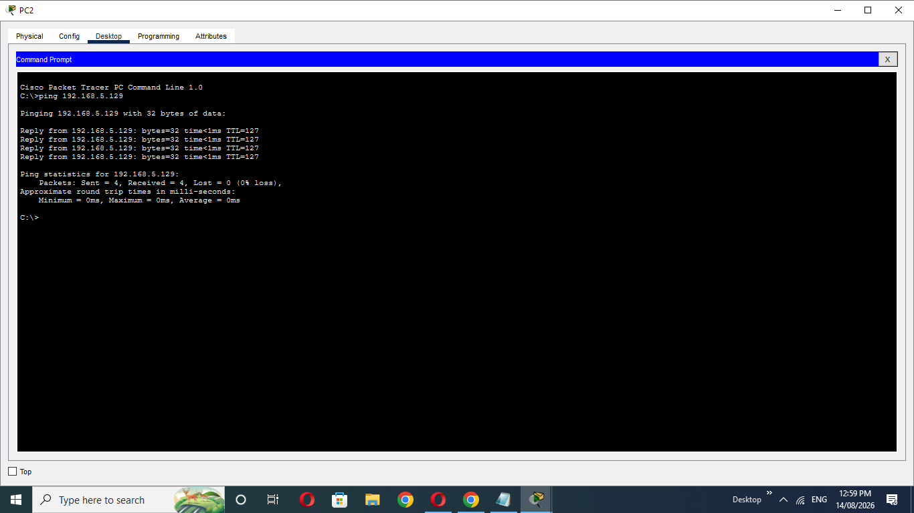
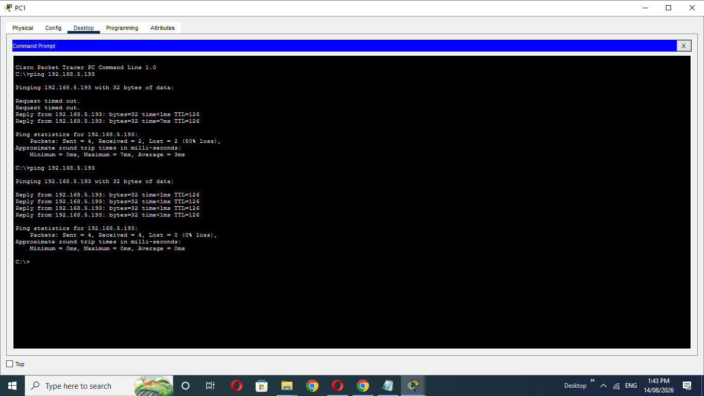

# VLSM Network Design and Static Routing

## 1. What did I want to do?

The goal of this lab was to practice **VLSM (Variable Length Subnet Masking)** and static routing using Cisco Packet Tracer.

I wanted to:

* Subnet the `192.168.5.0/24` network according to the number of hosts required by each LAN.
* Create a separate subnet for the point-to-point connection between R1 and R2.
* Assign the **first usable IP address** to the PC in each LAN.
* Assign the **last usable IP address** to the router interface in each LAN.
* Configure static routes so that all PCs can communicate with each other.

---

## 2. Network Topology

The topology contains:

* 2 routers: R1 and R2
* 4 switches: SW1, SW2, SW3, SW4
* 4 PCs: PC1, PC2, PC3, PC4
* 4 LANs
* 1 point-to-point connection between R1 and R2

### Host Requirements

| Network | Required Hosts |
| ------- | -------------: |
| LAN1    |             45 |
| LAN2    |             64 |
| LAN3    |             14 |
| LAN4    |              9 |
| R1–R2   |              2 |

---

## 3. VLSM Subnetting

The original network was:

```text
192.168.5.0/24
```

I allocated the subnets from the largest host requirement to the smallest.

### LAN2 — 64 Hosts

```text
Network:        192.168.5.0/25
Subnet Mask:    255.255.255.128
Usable Range:   192.168.5.1 - 192.168.5.126
Broadcast:      192.168.5.127
PC2:            192.168.5.1
R1 G0/1:        192.168.5.126
```




### LAN1 — 45 Hosts

```text
Network:        192.168.5.128/26
Subnet Mask:    255.255.255.192
Usable Range:   192.168.5.129 - 192.168.5.190
Broadcast:      192.168.5.191
PC1:            192.168.5.129
R1 G0/0:        192.168.5.190
```




### LAN3 — 14 Hosts

```text
Network:        192.168.5.192/28
Subnet Mask:    255.255.255.240
Usable Range:   192.168.5.193 - 192.168.5.206
Broadcast:      192.168.5.207
PC3:            192.168.5.193
R2 G0/0:        192.168.5.206
```


### LAN4 — 9 Hosts

```text
Network:        192.168.5.208/28
Subnet Mask:    255.255.255.240
Usable Range:   192.168.5.209 - 192.168.5.222
Broadcast:      192.168.5.223
PC4:            192.168.5.222
R2 G0/1:        192.168.5.209
```




### R1–R2 Point-to-Point Connection

```text
Network:        192.168.5.224/30
Subnet Mask:    255.255.255.252
Usable Range:   192.168.5.225 - 192.168.5.226
Broadcast:      192.168.5.227

R1 G0/0/0:      192.168.5.225
R2 G0/0/0:      192.168.5.226
```

## Connectivity Test

After configuring the IP addresses and static routes, I tested connectivity between the PCs using `ping`.

The objective was to verify that all PCs could communicate across the different LANs.

### PC2 → PC1



### PC1 → PC3

